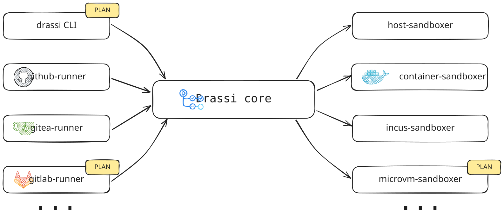

`drassi`
=======
drassi `/δράση/` (Greek for `action`) is an alternative implementation of GitHub's [`actions/runner`](https://github.com/actions/runner)
which aim to make your jobs spawn faster, more lightweight, and able to run everywhere you are.
Another goal of this project is become a framework to lets you build your own CI runner for 
self-hosted git services like [Gitea](https://about.gitea.com), [Forgejo](https://forgejo.org/), ... 

## 1. Architecture

